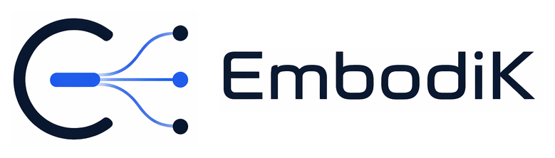

<picture>
  <source media="(prefers-color-scheme: dark)" srcset="docs/assets/brand/embodik-wordmark-dark.png">
  
</picture>

# EmbodiK


[](https://github.com/robodreamer/embodik/actions/workflows/ci.yml)
[](https://pypi.org/project/embodik/)
[](https://robodreamer.github.io/embodik/)
[](LICENSE)
[](https://github.com/robodreamer/embodik/stargazers)

EmbodiK is a high-performance prioritized numerical inverse kinematics library for cross-embodiment robotics and VLA/AI applications. It pairs a C++ core with Python bindings, exposes robot-model utilities without requiring the Python `pin` package at runtime, and includes interactive examples for collision-aware IK, CoM constraints, teleop, whole-body robots, GPU batch solving, and dual-arm coordination.

## ✨ Overview

EmbodiK is designed for bringing up IK behavior across different robot bodies without rewriting the solver stack for each model. The public examples focus on a practical path:

- 🧭 start with the smallest fixed-base IK loop.
- 🛡️ add collision, joint-limit, and CoM constraints.
- 🎮 connect the same prioritized IK solver path to teleop input.
- 🤖 scale to bimanual, humanoid, and Spot whole-body examples.
- 🧪 use richer clone-only examples for development, stress testing, and policy rollout.

The intent is to keep Python examples lean: visualization and target plumbing
stay in Python, while constraint handling and recovery policy stay in the C++
solver.

The detailed installation notes, API reference, and example walkthroughs live in the official documentation:

https://robodreamer.github.io/embodik/

## ⚡ GPU WBC at 1,024 Worlds

<a href="https://robodreamer.github.io/embodik/examples/parallel_trajectory_tracking/">
  
</a>

The experimental `embodik.gpu.wbc` path combines model-derived Newton
kinematics with Warp directional SRINV. The same batch API above derives its
joint and task dimensions from Panda, AI Worker, and G1 models—there is no
robot-family DoF table in the solver. The viewer renders all 1,024 articulated
robots with shared per-link mesh instances. Four colored world bands follow
circle, figure-eight, helix, or sweep targets, with independent phases and
speeds inside each band.

The hero capture renders 512 robots for clearer motion at README scale; the
same example renders and solves 1,024 worlds by default.

On a CUDA-capable NVIDIA GPU with approximately 24 GB of device memory, 1,024
device-resident worlds measured the following warm solve-only latency (50
samples after 20 warm-up steps, two solver iterations):

| Model | Active DoF | 6D tasks / world | p50 | Throughput |
| --- | ---: | ---: | ---: | ---: |
| Franka Panda | 7 | 1 | 0.906 ms | 1.13M worlds/s |
| ROBOTIS AI Worker SG2 | 15 | 2 | 4.854 ms | 211k worlds/s |
| Unitree G1 | 29 | 4 | 20.295 ms | 50.4k worlds/s |

### Status, compatibility, and requirements

GPU WBC is experimental and opt-in; the CPU solver remains the stable default.
It requires an NVIDIA CUDA device recognized by Torch, Warp, and Newton plus
the `embodik[gpu-wbc]` dependencies and a compatible Newton build. Fixed-base
scalar-joint models and standard floating-base models are supported; other
joint manifolds fail explicitly. There is no silent CPU fallback.

These numbers time the CUDA solve only; target generation, browser rendering,
collision, and host publication are excluded. Read the [GPU WBC guide](https://robodreamer.github.io/embodik/gpu_solvers/)
for supported constraints, requirements, single-world tradeoffs, and a
reproducible headless command.

## 🚀 Quick Start

Fastest path for most users is the wheel-only PyPI install inside a virtual
environment:

```bash
python -m venv .venv
source .venv/bin/activate
python -m pip install -U pip
python -m pip install --only-binary=:all: embodik
python -c "import embodik; print(embodik.__version__)"
```

If that import works, the core package is installed.

If pip cannot find a compatible wheel, use the one-shot source installer for
your platform from the [Installation Guide](https://robodreamer.github.io/embodik/installation/).
It creates the venv, installs native dependencies, builds EmbodiK, and runs an
import smoke test.

To run copied examples from the same venv:

```bash
python -m pip install "embodik[examples]"
embodik-examples --copy
cd embodik_examples
python 01_basic_ik_simple.py
```

Published repaired wheels do not require the Python `pin` package at runtime.
Source builds use `pin` or a system Pinocchio install as the native library
provider; keep that provider installed in the environment used to import
EmbodiK.

## 🎮 Examples

The pip-facing examples are intentionally split by purpose:

| Script | Purpose |
| --- | --- |
| `01_basic_ik_simple.py` | Minimal fixed-base IK bring-up for a robot preset or new URDF. |
| `02_collision_aware_IK.py` | Collision-aware IK behavior demo and advanced tuning surface. |
| `03_teleop_ik.py` | Small adapter showing how teleop input drives the same IK solver path. |
| `04_com_constraint_example.py` | CoM support-polygon constraint visualization. |
| `05_dual_arm_ects.py` | Dual-arm ECTS and orthogonal coordination modes. |
| `06_bimanual_whole_body_ik.py` | Bimanual whole-body teleop, defaulting to AI Worker and optionally supporting RB-Y1, with CoM, collision handling, torso gizmo control, torso/arm contribution controls, adaptive tuning, and optional Seer input. |
| `07_unitree_g1_retargeting_ik.py` | Unitree G1 whole-body retargeting IK with CoM and optional collision handling. |
| `08_spot_full_body_ik_viser.py` | Spot full-body IK in regular Viser with arm+torso, torso-only, full-body, and two-stage modes. |
| `09_spot_locomanip_mjviser.py` | Spot locomanipulation ONNX policy rollout in MuJoCo through mjviser. |
| `parallel_trajectory_tracking.py` | Model-derived Newton/Warp GPU WBC over independently targeted Panda, AI Worker, or G1 worlds. |

Run them from a copied example directory:

```bash
python 02_collision_aware_IK.py
python 03_teleop_ik.py
python 06_bimanual_whole_body_ik.py
python 07_unitree_g1_retargeting_ik.py
python 08_spot_full_body_ik_viser.py
```

For Seer/xvisio controller input in the public teleop examples, install the
teleop extra and pass the controller port:

```bash
python -m pip install "embodik[examples,teleop]"
python 06_bimanual_whole_body_ik.py --controller-port /dev/ttyUSB0
```

The regular Viser Spot full-body IK example uses the standard example
dependencies and includes a bundled Spot-with-arm URDF. The
MuJoCo/mjviser locomanipulation example needs the optional mjviser stack and
includes a bundled public MuJoCo Menagerie Spot-with-arm MJCF scene.
`mjviser` is the MuJoCo-backed web viewer environment for policy rollout and
interactive simulation. `mjviser-teleop` is the same viewer stack plus the
optional Seer/xvisio controller dependencies, so use it only when running
`--enable-teleop`:

```bash
python -m pip install "embodik[mjviser]"
embodik-examples --copy
cd embodik_examples
python 09_spot_locomanip_mjviser.py --policy locomanip
python 09_spot_locomanip_mjviser.py --policy locomanip-stationary
# add the optional Seer controller extra when needed:
python -m pip install "embodik[mjviser,teleop]"
python 09_spot_locomanip_mjviser.py --enable-teleop --policy locomanip
```

From a repository checkout, run the same example from the repository root with
the matching Pixi environment and task:

```bash
pixi run -e mjviser spot-locomanip-mjviser --policy locomanip
pixi run -e mjviser-teleop spot-locomanip-mjviser --enable-teleop --policy locomanip
```

Use the `spot-locomanip-mjviser` Pixi task from a checkout, not raw
`pixi run -e mjviser-teleop python examples/09_spot_locomanip_mjviser.py`, on
a fresh environment. The task depends on `install`, so it builds/installs the
native EmbodiK extension before launching the example.

See the [Spot locomanipulation guide](https://robodreamer.github.io/embodik/examples/spot_locomanip_mjviser/)
for mjviser, Seer teleop, solver tuning, and headless validation details.

Most examples default to the Panda preset. Use `--robot <key>` when a script supports alternate robot presets. See the [Examples Guide](https://robodreamer.github.io/embodik/examples/) for the full catalog, helper conventions, and clone-only development examples.

## 🎬 Preview

**Franka Panda collision-free IK**

<a href="https://robodreamer.github.io/embodik/">
  
</a>

**ROBOTIS AI Worker constraint teleop**

<a href="https://robodreamer.github.io/embodik/examples/bimanual_whole_body_ik/">
  
</a>

**RB-Y1 bimanual whole-body IK**

<a href="https://robodreamer.github.io/embodik/examples/bimanual_whole_body_ik/">
  
</a>

**Unitree G1 retargeting IK**

<a href="https://robodreamer.github.io/embodik/examples/unitree_g1_retargeting_ik/">
  
</a>

**Spot full-body IK**

<a href="https://robodreamer.github.io/embodik/examples/spot_full_body_ik/">
  
</a>

**Spot locomanipulation mjviser**

<a href="https://robodreamer.github.io/embodik/examples/spot_locomanip_mjviser/">
  
</a>

## 🧰 Core Capabilities

- ⚙️ C++ IK core with Nanobind Python bindings.
- 🎯 Hierarchical velocity IK tasks for frames, posture, CoM, and dual-arm coordination.
- 🧮 Fixed-base acceleration eSNS with compatible position, velocity, acceleration, effort, contact-kinematics, and geometry constraints.
- 🛡️ Joint-limit, self-collision, and CoM support-polygon constraints.
- 📈 Solver diagnostics for timing, task scaling, and Jacobian condition-number logging.
- 🧭 Lie-group-aware configuration operations for floating-base, quaternion, and continuous joints.
- 🤖 Native Pinocchio-backed robot model utilities exposed through EmbodiK bindings.
- 👁️ Optional Viser visualization for interactive IK demos.
- ⚡ Model-derived Newton/Warp GPU WBC with device-resident multi-world state, CUDA graph execution, collision constraints, task priority, posture, torso, and centroidal features.

## 📚 Documentation

- [Installation](https://robodreamer.github.io/embodik/installation/) - platform setup, source builds, and troubleshooting.
- [Quickstart](https://robodreamer.github.io/embodik/quickstart/) - first IK calls and solver concepts.
- [Acceleration Solver](https://robodreamer.github.io/embodik/acceleration_solver/) - fixed-base scope, state-box semantics, and collision certification boundaries.
- [Working with Transforms](https://robodreamer.github.io/embodik/transforms/) - transform helpers and SE(3) operations.
- [Examples](https://robodreamer.github.io/embodik/examples/) - public scripts and development-only demos.
- [API Reference](https://robodreamer.github.io/embodik/api/) - Python API generated from docstrings.
- [GPU WBC](https://robodreamer.github.io/embodik/gpu_solvers/) - Newton/Warp setup, model compatibility, constraint coverage, batching, and performance methodology.
- [Development](https://robodreamer.github.io/embodik/development/) - local build, tests, and contributor workflow.

## 🛠️ Development

Use Pixi from a repository clone:

```bash
pixi run build
pixi run test
pixi run docs-build
```

Run examples from the clone:

```bash
pixi run python examples/01_basic_ik_simple.py
pixi run python examples/02_collision_aware_IK.py
pixi run python examples/03_teleop_ik.py
```

## 🗂️ Repository Layout

```text
embodik/
|-- README.md
|-- cpp_core/
|   |-- include/embodik/
|   `-- src/
|-- python_bindings/
|   `-- src/
|-- python/embodik/
|-- examples/
|-- docs/
|-- scripts/
`-- test/
```

## ⭐ Star History

[](https://www.star-history.com/#robodreamer/embodik&Date)

## 📄 License

EmbodiK is released under the Apache License 2.0. See [LICENSE](LICENSE) for details.
Binary wheels may bundle permissively licensed native dependencies; see
[THIRD_PARTY_NOTICES.md](THIRD_PARTY_NOTICES.md).

Developer: Andy Park <andypark.purdue@gmail.com>
