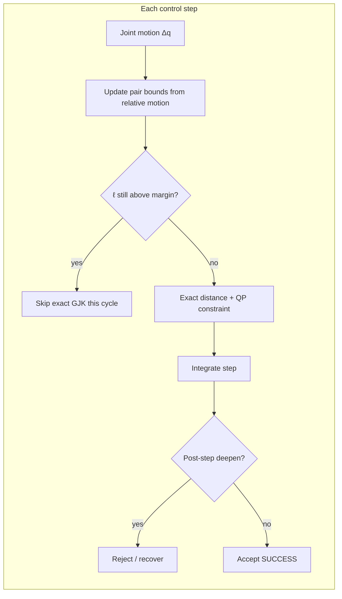

# Collision constraints and tuning

EmbodiK treats collision avoidance as a **stack** of mechanisms, not a single distance check.
That design keeps dual-arm teleop and whole-body control (WBC) fast while still rejecting steps
that deepen penetration.

!!! info "Related guides"
    **Recovery when stuck at margins** (stall handler, floors, weighted fallback) →
    [Solver Robustness & Recovery](solver_robustness.md).
    **Guide map** → [Guides overview](guides/index.md).
    **Runnable demo** → [Collision-Aware IK](examples/collision_aware_ik.md).

## The WBC collision bottleneck

Whole-body control has to balance **speed**, **smoothness**, and **safety** at control rate.
A common bottleneck is collision checking: evaluating many link–link (and link–obstacle) pairs
every cycle. On dense humanoid or dual-arm models that can mean **hundreds of pairwise distance
queries per step** — fine for offline planning, expensive for real-time WBC.

EmbodiK addresses this with **conservative proximity bounds**, **pair caching**, and **three
tuning presets** so most cycles skip exact geometry work on clearly safe pairs.

### Pairwise spatial coherence

The core intuition: **if two shapes have not moved much relative to each other, we often do not
need an exact distance query this cycle.**

EmbodiK tracks how each candidate pair moved since the last exact check (relative translation
and rotation). From that motion it maintains **conservative bounds** on how far the true signed
distance could have changed:

| Bound | Meaning | How EmbodiK uses it |
|-------|---------|---------------------|
| **Lower bound** ℓ | Smallest distance the pair could now have | If ℓ is still **above** the safety margin, the pair is **clearly safe** → skip the expensive exact check |
| **Upper / broadphase bounds** | Pairs clearly far apart in space | Sphere broadphase and cache margins skip work on distant pairs |

This is **conservative**: we only skip work when bounds prove the pair remains outside the
danger zone. We do **not** underestimate collision risk to go faster.

Together with **proximity-gated QP rows** and an optional **time budget** on exact refinement
(Speed mode), compute concentrates on pairs that are close, recently moved, or candidates for
active constraints — not on the full combinatorial set every tick.

### What this unlocks

- **Large speedups on collision-heavy steps** — often **~10–50×** vs running full exact checks on
  every pair every cycle (see measured mode table below).
- **Three operating modes** — **Speed / Balanced / Precise** — accuracy vs compute without
  hand-tuning a dozen low-level flags.
- **Conservative safety on skipped pairs** — bound gates only elide checks when ℓ stays above
  margin; post-step guards still reject deepening penetration on accepted motion.
- **Richer real-time motion** — whole-body IK and teleop with complex self-collision geometry
  within latency budgets naive full-scan pipelines cannot meet.



## Why this is stronger than naive approaches

Many IK pipelines use **one** of the patterns below. EmbodiK composes them so you can choose
speed without giving up incremental safety.

| Naive pattern | Problem | EmbodiK |
|---------------|---------|---------|
| Full distance scan every step | Correct but too slow for teleop | **Speed / Balanced** presets: cache, broadphase, optional refinement budget |
| Inequality constraints only | Penetration creeps across integrated steps | **Post-step acceptance** rejects deepening penetration |
| Hard reject on any violation | Zero-motion freezes near margins | **Non-worsening floors** + bounded escape recovery |
| Fixed top‑K pairs forever | Misses newly tight pairs on large sweeps | Tunable **`max_constraints`** + eval harness for ground truth |
| Same ε for all pairs | Wrong trade-off for margin-floor recovery | Separate worsen tolerances when `structural_floor ≥ margin` |

EmbodiK’s difference is **composition**: soft QP steering, preset-tuned pair monitoring,
per-pair non-worsening memory, post-step guards, and explicit separation between **solver stall**
and **eval harness holds**.

## Speed, Balanced, and Precise

Three presets control cache cadence, sphere broadphase, proximity-gated constraint activation,
and the exact-distance refinement budget. New solvers default to **`CollisionTuningMode.BALANCED`**.

| Preset | Best for | Trade-off |
|--------|----------|-----------|
| **SPEED** | High-rate teleop, Viser loops | **Time budget** (~300 µs refinement cap); fastest median step time |
| **BALANCED** | Most examples and WBC replay harness | Conservative cache, no refinement early-stop; default |
| **PRECISE** | Regression debug, distance fidelity | Cache off, broadphase off; full exact checks |

```python
import embodik as eik

solver = eik.KinematicsSolver(robot)
solver.set_collision_tuning_mode(eik.CollisionTuningMode.BALANCED)
# eik.CollisionTuningMode.SPEED  — bounded latency for high-rate teleop
# eik.CollisionTuningMode.PRECISE — full exact checks for debug / regression
```

Maintained examples also expose `apply_collision_tuning_mode(solver, "balanced")` via
`examples/example_helpers/ik_common.py`.

### Measured step time (Panda, moving target)

On a representative Panda `solve_position_step` workload (see
`scripts/benchmark_collision_tuning_modes.py`), median collision-inclusive step time typically
looks like:

| Mode | Median step time (indicative) | Role |
|------|-------------------------------|------|
| **SPEED** | **≲ 0.3 ms** (often ~0.1 ms in repo baselines) | Teleop / WBC hot path |
| **BALANCED** | **~0.4–0.5 ms** | Default interactive mode |
| **PRECISE** | **≳ 5 ms** (often ~7–8 ms in repo baselines) | Ground-truth distance fidelity |

The clip below shows the same tracking workload while switching collision presets — per-step
elapsed time rises from **Speed** to **Precise** (with **Balanced** in between) while the solver
continues to follow the target:

<video autoplay muted loop playsinline controls width="100%" src="../assets/media/wbc_collision_tuning_modes.mp4"></video>

Re-run on your robot before quoting externally:

```bash
pixi run python scripts/benchmark_collision_tuning_modes.py
```

### Performance vs naive full scan

CI regression tests (`test/test_collision_tuning_perf.py`) lock in that **Speed** stays under
**3 ms** median per Panda `solve_position_step`, **Balanced** under **4 ms**, and **Speed** stays
well below **Precise** — while all three modes still pass penetration safety checks.

A naive **exact full pair scan after every integration step** bypasses these optimizations and
is much slower on the same workload. EmbodiK’s post-step guard uses the **tuned evaluation path**,
not an unbounded full scan.

## Parallel batch IK (offline / analysis)

Real-time WBC uses one solver per control loop, but **offline workloads scale out**: morphology
studies, reachability grids, and parameter sweeps fire thousands of independent IK solves.

EmbodiK supports this pattern well: large IK reachability and morphology sweeps can use
**`num_workers > 1`** with a **process pool** so each worker owns an EmbodiK solver instance —
no shared mutable solver state across processes. That combination (per-process solvers +
conservative collision presets on hot paths) keeps sweep throughput practical while still using
the same collision stack as teleop.

For GPU-scale batch trajectories inside EmbodiK itself, see
[GPU Solvers](gpu_solvers.md) and `examples/parallel_trajectory_tracking.py`.

## Configure collision avoidance

```python
solver.configure_collision_constraint(
    min_distance=0.04,       # required clearance (metres)
    include_pairs=[],        # empty = all configured pairs
    exclude_pairs=exclusions,
    nearest_points_all_pairs=False,
    max_constraints=3,       # top-K active QP rows; raise for large sweeps
)
```

### Non-worsening recovery floor

Whole-body models often rest closer than `min_distance` on structural pairs (upper arm vs torso).
Enable the floor so recovery does not try to push those pairs to the global margin and freeze:

```python
solver.set_non_worsening_collision_floor_enabled(True)
solver.set_collision_structural_floor(0.005)  # default 5 mm; raise to match WBC margin if needed
```

**Penetrating vs close clearance:** if a pair is first seen **inside the mesh** (negative signed
distance), EmbodiK seeds recovery toward the configured floor — not zero clearance — so the arm
can exit penetration without treating interpenetration as a valid rest pose.

See [KinematicsSolver — Collision recovery floor](api/kinematics_solver.md#collision-recovery-floor).

### Position-step safety and fallback

For teleop loops:

- Post-step checks reject SUCCESS when penetration **deepens** beyond tolerance.
- `PositionStepOptions.primary_allow_min_error_fallback = True` retries once with MIN_ERROR when
  collision rows collapse primary task scale — unfreezing motion near the body without abandoning
  hard constraints.

## Eval harness vs solver

Segment validators and integrated WBC eval may apply a **stricter actionable-pair gate** (e.g.
10 mm on specific link classes) using full geometry queries. That is **eval policy**.

The solver reports **`NO_PROGRESS`**, **`COLLISION_VIOLATED`**, and **`collision_rejection_count`**
separately from harness **Hold%** / **Back%**. Do not treat a safety hold as a solver stall.

## Examples and diagnostics

- Runnable demo: [Collision-Aware IK Example](examples/collision_aware_ik.md)
- Recovery policy overview: [Solver Robustness & Recovery](solver_robustness.md)
- Guide map: [Guides overview](guides/index.md)

```bash
pixi run python scripts/diagnose_collision_pair_membership.py torso_link right_bicep_yaw_link
pixi run python scripts/prove_sweep_collision_metric.py
pixi run python scripts/validate_wbc_segments.py
```

## API reference

- [KinematicsSolver](api/kinematics_solver.md) — `configure_collision_constraint`, tuning presets, floors
- [RobotModel](api/robot_model.md) — collision pair configuration and distance queries

## Acknowledgments

Collision bound gating and the Speed / Balanced / Precise time-or-accuracy preset idea draw on
Daniel Rakita's **Proxima** proximity work ([RSS 2022](http://roboticsproceedings.org/rss18/p043.html)).
EmbodiK implements its own Pinocchio/hpp-fcl stack on top of that idea; it is not a port of the
[Optima toolbox](https://github.com/djrakita/optima_toolbox).
