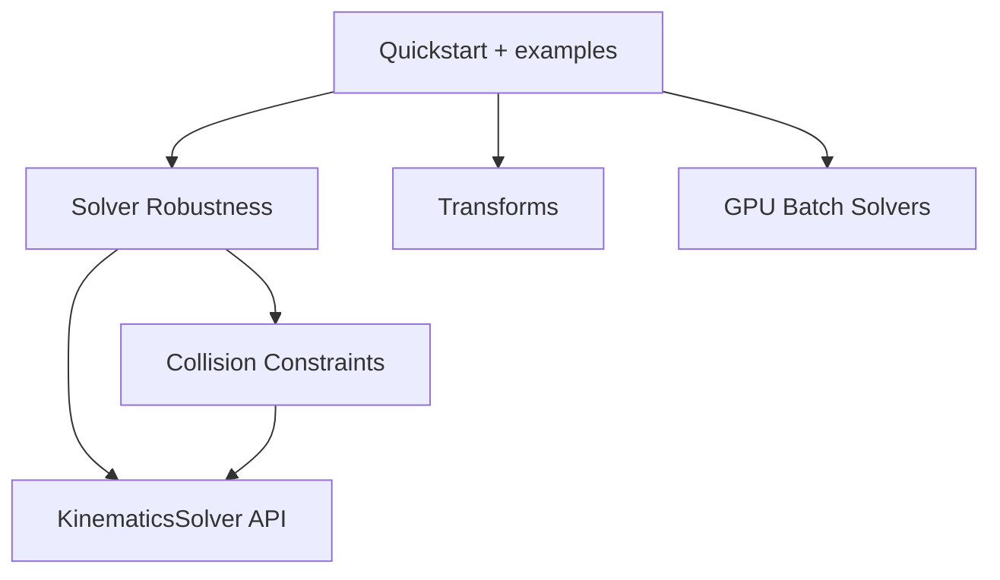

# Guides

Topic guides for EmbodiK beyond the [Quickstart](../quickstart.md). Use them when you need
solver behavior, safety tuning, or scale-out patterns — not when you are still wiring your
first `solve_position_step()` loop.

## Choose a path

| Your goal | Start here | Then |
|-----------|------------|------|
| First working IK loop | [Quickstart](../quickstart.md) → [Basic IK](../examples/basic_ik.md) | [KinematicsSolver API](../api/kinematics_solver.md) |
| Teleop freezes, weak tracking, or limit stalls | [Solver Robustness & Recovery](../solver_robustness.md) | [Teleop IK](../examples/teleop_ik.md), [Collision-Aware IK](../examples/collision_aware_ik.md) |
| Collision too slow or too strict in WBC | [Collision Constraints & Tuning](../collision_constraints.md) | [Collision-Aware IK](../examples/collision_aware_ik.md) |
| Whole-body stability (CoM, dual-arm) | [CoM example](../examples/com_constraint_ik.md), [Dual-Arm ECTS](../examples/dual_arm_ects.md) | [Solver Robustness](../solver_robustness.md) (stall + fallback) |
| Batch / GPU throughput | [GPU Batch Solvers](../gpu_solvers.md) | [GPU examples](../examples/gpu_batch_ik.md) |
| Rotation / pose math without SciPy | [Working with Transforms](../transforms.md) | [Transforms API](../api/transforms.md) |

## How the solver guides fit together

**[Solver Robustness & Recovery](../solver_robustness.md)** covers runtime policy in C++:
adaptive dt, elastic joint limits, auto task layout, weighted fallback, stall handler, CoM
proximity rows, and diagnostics. Read this when interactive loops stall or behave inconsistently
near limits.

**[Collision Constraints & Tuning](../collision_constraints.md)** covers the collision *stack*:
pairwise bounds, Speed / Balanced / Precise presets, post-step guards, non-worsening floors, and
offline process-pool sweeps. Read this when collision checking dominates latency or when you need
to trade fidelity for control rate.

The two guides overlap by design — robustness explains *recovery*, collision explains *monitoring
and acceptance*. Example scripts link to both; the [KinematicsSolver API](../api/kinematics_solver.md)
is the reference for flags and result fields.

## Related

- [Examples overview](../examples/index.md) — runnable scripts grouped by skill level
- [API Reference](../api/index.md) — autogenerated class docs
- [Development](../development.md) — build, test, and release workflow
