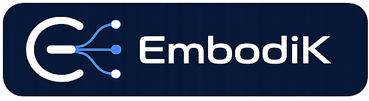
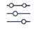
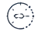

<h1 class="embodik-doc-heading">
  <span class="embodik-sr-only">EmbodiK</span>
  
  
</h1>

**High-performance prioritized numerical inverse kinematics for cross-embodiment robotics and VLA/AI applications**

EmbodiK is a modern C++ prioritized numerical IK library with Python bindings
for robot bring-up, teleoperation, retargeting, and whole-body IK examples. It
is built on [Pinocchio](https://github.com/stack-of-tasks/pinocchio), exposed to
Python through [Nanobind](https://github.com/wjakob/nanobind), and keeps
task hierarchy, constraints, and recovery policy in the solver so examples can
stay focused on targets and visualization.

## Design Principles

<div class="embodik-principles" markdown>
<div class="embodik-principle">
  
  <div><strong>Cross-Embodiment</strong><span>Apply one IK policy across arms, humanoids, quadrupeds, and mobile bases.</span></div>
</div>
<div class="embodik-principle">
  
  <div><strong>Solver Intelligence</strong><span>Keep priority, recovery, diagnostics, and constraint policy in the solver.</span></div>
</div>
<div class="embodik-principle">
  
  <div><strong>Reliable &amp; Safe</strong><span>Respect limits, collision constraints, CoM support, and contact feasibility.</span></div>
</div>
<div class="embodik-principle">
  
  <div><strong>Scalable</strong><span>Use the same solver surface for demos, stress tests, and policy rollout.</span></div>
</div>
</div>

## GPU WBC: 1,024 Independent Worlds

<video autoplay muted loop playsinline controls width="100%" aria-label="Panda, ROBOTIS AI Worker, and Unitree G1 moving in parallel Viser worlds while EmbodiK solves 1,024 independently targeted worlds on CUDA" src="assets/media/gpu_wbc_parallel_showcase.mp4"></video>

The experimental model-derived GPU path uses Newton for batched kinematics and
Warp directional SRINV for prioritized velocity IK. A single public example
selects Panda, AI Worker, or G1 and derives the active joints and task shape from
the loaded model. Its 32×32 colored world map exposes all 1,024 solved instances,
while detailed robots sampled across the batch follow four distinct motion
families with independent phases and speeds.

| Model | Active DoF | 6D tasks / world | Solve-only p50 |
| --- | ---: | ---: | ---: |
| Franka Panda | 7 | 1 | 0.906 ms |
| ROBOTIS AI Worker SG2 | 15 | 2 | 4.854 ms |
| Unitree G1 | 29 | 4 | 20.295 ms |

Profile: 1,024 CUDA-resident worlds, two solver iterations, 50 measured steps
after 20 warm-up steps, CUDA-capable NVIDIA GPU with approximately 24 GB of
device memory.
Target generation, visualization, collision, and host publication are excluded.
See [GPU WBC](gpu_solvers.md) for the full capability matrix and
[Parallel GPU WBC](examples/parallel_trajectory_tracking.md) to reproduce it.

## ✨ Features

- **⚙️ Fast C++ core**: Eigen-based IK routines with Python bindings and numpy support.
- **🎯 Prioritized task hierarchy**: Register frame, posture, relative-pose, and CoM objectives with explicit priorities.
- **🛡️ Solver-owned robustness**: Elastic limits, adaptive dt, auto task layout, weighted fallback, stall recovery, and collision guards — in C++.
- **⚡ Tunable collision stack**: Speed / Balanced / Precise presets, conservative bounds, and post-step guards — often ~10–50× faster collision steps vs naive full scans.
- **🔒 Hard-constraint handling**: Joint limits, collision constraints, CoM support polygons, contact, and relative-pose checks stay in C++.
- **📈 Diagnostics**: Timing, condition numbers, recovery stage, task scaling, and solver status reporting.
- **🎮 Examples and visualization**: Viser and mjviser demos for Panda, AI Worker, RB-Y1, Unitree G1, and Spot workflows.
- **⚡ Model-derived GPU WBC**: Newton/Warp CUDA execution for one interactive robot or thousands of independent worlds, without robot-family dimension constants.

## 🚀 Quick Start

Install EmbodiK, run a maintained example, then adapt the registered-task API
pattern from that script:

```bash
python -m pip install --only-binary=:all: "embodik[examples]"
python -c "import embodik; print(embodik.__version__)"
embodik-examples --copy
cd embodik_examples
python 01_basic_ik_simple.py
```

See the [Quickstart](quickstart.md) and [Examples](examples/index.md) pages for
the current `KinematicsSolver`, `add_frame_task()`, and `solve_position_step()`
workflow.

## 📦 Installation

See the [Installation Guide](installation.md) for wheel, source-build, and
troubleshooting instructions.

```bash
python -m pip install --only-binary=:all: embodik
```

## 📚 Documentation

### Learn

- [Quickstart](quickstart.md) — Build a small prioritized IK example with registered tasks.
- [Examples](examples/index.md) — Run maintained public examples and clone-only development demos.
- [Guides overview](guides/index.md) — Pick a reading path (robustness, collision, GPU, transforms).

### Configure the solver

- [Solver Robustness & Recovery](solver_robustness.md) — Adaptive dt, elastic limits, auto layout, weighted fallback, stall recovery.
- [Acceleration Solver](acceleration_solver.md) — Fixed-base acceleration eSNS, compatible state boxes, effort/contact rows, and collision certification boundaries.
- [Collision Constraints & Tuning](collision_constraints.md) — Tuning presets, safety layers, and performance vs naive full-scan checks.
- [GPU WBC](gpu_solvers.md) — Newton/Warp setup, model compatibility, constraints, batching, and measured performance.

### Reference

- [KinematicsSolver API](api/kinematics_solver.md) — Tasks, constraints, runtime policy, and diagnostics.
- [AccelerationSolver guide and API](acceleration_solver.md) — Explicit `q`, `dq`, `dt` acceleration solves and supported fixed-base scope.
- [RobotModel API](api/robot_model.md) — Load models, compute FK/Jacobians, and query collisions or CoM.
- [Installation Guide](installation.md) — Install wheels, source builds, and optional example extras.
- [Development Guide](development.md) — Local builds, tests, and release workflow.

## 🎬 Preview

**Franka Panda collision-free IK**

<video autoplay muted loop playsinline controls width="100%" src="assets/media/franka_panda_collision_free_ik.mp4"></video>

**ROBOTIS AI Worker constraint teleop**

<video autoplay muted loop playsinline controls width="100%" src="assets/media/robotis_ai_worker_collision_free_ik.mp4"></video>

**RB-Y1 bimanual whole-body IK**

<video autoplay muted loop playsinline controls width="100%" src="assets/media/rby1_collision_free_ik.mp4"></video>

**Unitree G1 retargeting IK**

<video autoplay muted loop playsinline controls width="100%" src="assets/media/unitree_g1_retargeting_ik.mp4"></video>

**Spot full-body IK**

<video autoplay muted loop playsinline controls width="100%" src="assets/media/spot_fullbody_interactive_ik.mp4"></video>

**Spot locomanipulation mjviser**

<video autoplay muted loop playsinline controls width="100%" src="assets/media/spot_locomanip_interactive_ik_mjviser.mp4"></video>

## 📄 License

Apache License 2.0 - see the [LICENSE](https://github.com/robodreamer/embodik/blob/main/LICENSE) file for details. Source: [robodreamer/embodik](https://github.com/robodreamer/embodik)

**Copyright (c) 2026 Andy Park <andypark.purdue@gmail.com>**
